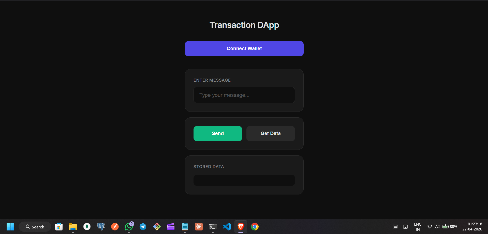
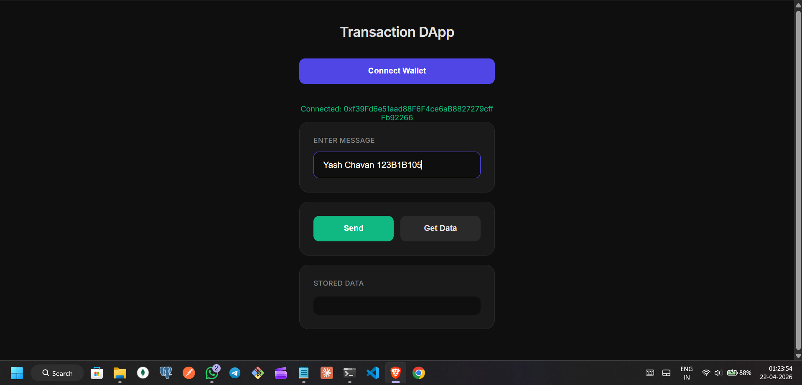
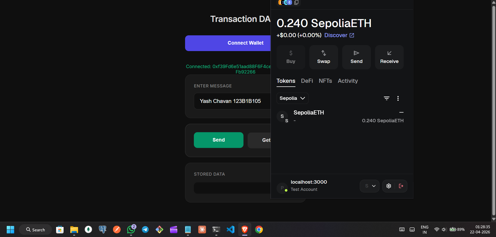

# Assignment 3: Web Interface for Blockchain Transactions

## 📌 Objective

To design and implement a web-based decentralized application (DApp) that allows users to connect their wallet and send transactions to a smart contract using MetaMask.

---

## 🧾 Brief Description

This project is a simple **Product Transaction DApp** where users can:

* Connect their wallet using MetaMask
* Enter product details
* Send transactions to the blockchain
* Retrieve stored data from the smart contract

The frontend interacts with a deployed Solidity smart contract using **ethers.js**.

---

## 🛠️ Tech Stack Used

* **Solidity** – Smart contract development
* **Remix IDE** – Contract compilation and deployment
* **MetaMask** – Wallet connection and transaction signing
* **Ethers.js** – Blockchain interaction from frontend
* **HTML/CSS/JavaScript** – Frontend development
* **Sepolia Testnet** – Blockchain network used

---

## 🔗 Smart Contract Details

* **Contract Name:** MessageStore
* **Network:** Sepolia Testnet
* **Contract Address:** `0x867957d763c1122f6f08b9c5a03567bf6f997e26`

---

## ⚙️ How Frontend Connects to Blockchain

1. The browser detects MetaMask using `window.ethereum`
2. A provider is created using `ethers.providers.Web3Provider`
3. A signer is obtained to sign transactions
4. A contract instance is created using:

   ```javascript
   new ethers.Contract(contractAddress, abi, signer)
   ```
5. Smart contract functions are called using this contract instance

---

## 🦊 How MetaMask is Used

* Connects user wallet to the DApp
* Requests account access
* Signs and confirms transactions
* Pays gas fees (test ETH on Sepolia)

---

## 🚀 How to Run the Project

### Step 1: Setup Files

Ensure the following files are in the same folder:

```
index.html
style.css
app.js
ethers.js
```

---

### Step 2: Run Local Server

Using Python:

```bash
python -m http.server 3000
```

Open in browser:

```
http://127.0.0.1:3000
```

---

### Step 3: Connect Wallet

* Click **Connect Wallet**
* Approve connection in MetaMask

---

### Step 4: Send Transaction

* Enter product details
* Click **Send Transaction**
* Confirm transaction in MetaMask

---

### Step 5: Retrieve Data

* Click **Get Stored Data**
* View stored message from blockchain

---

## 📸 Screenshots

### 1. Wallet Connection


---

### 2. Transaction Execution (MetaMask Confirmation)


---

### 3. Transaction Success Alert


---

### 4. MetaMask Activity (Transaction Confirmed)


---

### 5.Stored Data from Smart Contract


